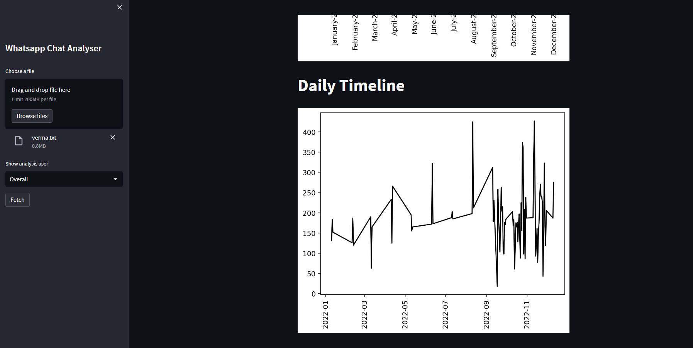

# Data Analyser App Whatsapp chat

This model can give overall stats and visualization term of the whatsapp chat.
While it may be group or individual.

## Demo

### API Reference
Streamlit with Pycharm IDE.

## Used By
Data analysis is the process of cleaning, changing, and processing raw data and extracting actionable, relevant information that helps businesses make informed decisions. The procedure helps reduce the risks inherent in decision-making by providing useful insights and statistics, often presented in charts, images, tables, and graphs.

*Limit:* 12 Hour format date, Group member name to be saved in contact list.
## Tech Stack
Client **Git**

Libraries used: Pandas, Numpy, streamlit, wordcloud, seaborn, matplotlib, urlextract, emojis etc.

